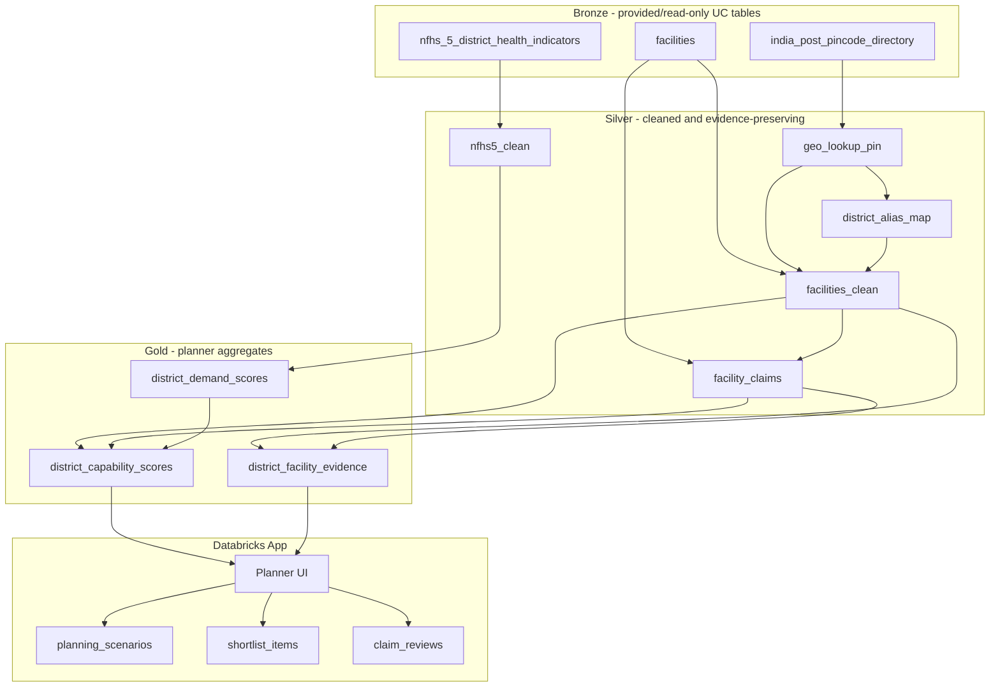

# Architecture Decision Record - Medical Desert Planner

Status: implemented for the data layer; app implementation not started.

## Product Workflow

The user is a non-technical healthcare planner. The app must answer:

> Where are the highest-risk gaps in care, and how confident are we that those gaps are real?

Minimum visible workflow:

1. Select a capability/specialty and a geography.
2. See regional coverage with uncertainty shown separately from risk.
3. Drill into the facilities behind an aggregate.
4. See verbatim source text for every important claim.
5. Save a planning scenario, notes, shortlists, and claim reviews.

## Key Decisions

| Decision | Choice | Rationale |
|---|---|---|
| Source of truth | Build from raw provided UC tables, not existing derived tables | The brief asks us not to inherit a prior design; live source profiling found enough raw quality issues to own the cleaning logic. |
| App framework | Databricks App, likely Streamlit first | Fast path for Free Edition and enough for map, filters, evidence drawer, and persistence. AppKit can be revisited if we want a richer React UI after the data layer is stable. |
| Primary capability selector | `specialties` taxonomy | Clean, compact, and already present. Free-text fields are too noisy to be the primary filter. |
| Evidence model | One row per verbatim claim | Satisfies citation requirement and keeps claims auditable. |
| Geography | PIN modal `(district, state)` -> alias table -> NFHS-5 key; unresolved bucket | PIN coverage is high, but exact NFHS match is only 61.4% of facilities before aliases. |
| Uncertainty | Model supply and evidence separately | A district with few records must read as data-poor, not as a confirmed medical desert. |
| Persistence | App-owned tables in `medical_desert_planner.app` | Stores scenarios, notes, shortlists, and claim reviews. Use Lakebase only if explicitly approved later. |

## Medallion Design

## Silver Layer

### `facilities_clean`

One row per valid facility. Filter invalid UUID rows, parse literal `"null"` strings,
clean 6-digit PINs, null out coordinates outside India bbox, normalize facility/operator
types, and attach geography.

Important columns:

- `facility_id`
- `name`
- `facility_type`
- `operator_type`
- `address_city_raw`
- `address_state_raw`
- `pin_code`
- `latitude`
- `longitude`
- `district_nfhs5`
- `state_nfhs5`
- `geo_match_method`: `pincode_exact`, `pincode_alias`, `coordinate_fallback`, `unresolved`
- `geo_confidence`: `high`, `medium`, `low`
- `specialties`
- `number_doctors`
- `capacity`
- `year_established`
- `source_urls`

### `geo_lookup_pin`

One row per PIN. Choose the modal post-office `(district, state)` pair and retain:

- `n_post_offices`
- `n_districts`
- `n_states`
- `district_agreement_pct`
- `state_agreement_pct`

### `district_alias_map`

Hand-reviewed mapping table for source district/state names that do not exact-match
NFHS-5. This is required because exact facility resolution via PIN is only 61.4% before
aliases.

### `facility_claims`

One row per evidence item. `claim_text` is always verbatim.

Claim sources:

- `specialties`: structured taxonomy, loaded as structured evidence.
- `capability`: free-text facility claims.
- `procedure`: free-text procedure claims.
- `equipment`: free-text equipment claims.
- `description`: sentence-level claims only when useful.

Classification:

- Start with deterministic rules for obvious terms and obvious noise.
- Optional LLM batch classification only after a dry run, with output stored as structured
  JSON and every result tied back to the exact `claim_text`.

Categories:

- `structured_specialty`
- `clinical_capability`
- `procedure`
- `equipment`
- `staffing`
- `accreditation`
- `volunteer_mission_signal`
- `noise`

## Gold Layer

### Demand Scores

`district_demand_scores` uses NFHS-5 demand-side indicators, not facility data. Candidate
inputs include:

- low `institutional_birth_5y_pct`
- low `institutional_birth_in_public_facility_5y_pct`
- low `hh_member_covered_health_insurance_pct`
- high `fp_unmet_total_cm_w15_49_7_pct`
- high `population_below_age_15_years_pct`
- poor infrastructure proxies such as sanitation, water, electricity, and clean fuel
- high anemia or low screening rates when indicator quality is adequate

Each indicator keeps:

- parsed numeric value
- `is_suppressed`
- `is_low_sample`
- source column name

If too many selected indicators are suppressed or low-sample, the district demand score is
marked low confidence.

### Capability Scores

For each `(district, specialty)`:

- `n_facilities`: all facilities resolved to the district.
- `k_facilities`: facilities with evidence for the selected specialty/capability.
- `p_hat = k / n`
- Wilson 95% interval: `wilson_lo`, `wilson_hi`
- `evidence_density`: combines `n_facilities`, claim count, and geography confidence.
- `demand_index`
- `gap_score`: high demand and low documented supply.
- `confidence_label`: `likely_real_gap`, `data_poor`, `mixed_evidence`, `lower_priority`.

This is the central design point: risk color and evidence confidence are separate. A low
`k` with very small `n` becomes `data_poor`, not a confirmed gap.

## App Design

Main screen:

- Capability selector using specialty display names.
- Geography selector: India, state, district, and explicit `Unresolved Geography`.
- Map or district bubble layer where color means gap risk and outline/pattern/badge means
  confidence.
- Ranked district table grouped by `Likely real gap`, `Data-poor high need`, and
  `Lower priority`.

Drill-down:

- District demand context with NFHS-5 values and quality flags.
- Facility list behind the aggregate.
- Facility evidence drawer showing verbatim claims, source field, source URL where
  available, and whether the claim is structured/rule/LLM-derived.

Persistence:

- Save scenario: specialty, geography, ranking state, notes.
- Shortlist facilities.
- Add facility notes.
- Mark claim as `verified`, `disputed`, or `unclear`, with reviewer note.

## Implemented Build

The data layer is implemented as a Databricks Asset Bundle:

- Bundle: `medical-desert-planner`
- Job resource: `medallion_build`
- Databricks job name: `medical-desert-medallion-build`
- Notebook: `src/notebooks/01_build_medallion.py`
- Catalog: `medical_desert_planner`
- Schemas: `bronze`, `silver`, `gold`, `app`

The current build is deterministic. It does not use `ai_query`, `ai_extract`, Genie, or
Vector Search. AI enrichment can be added later as a separate checkpointed job that maps
free-text claims onto the app-selectable specialties after a sample dry run.

## Tradeoffs

- PIN-based geography is imperfect, but it is better than city/state text and avoids
  expensive polygon work in the first pass. The alias table and unresolved bucket make the
  uncertainty explicit.
- Starting with `specialties` gives a reliable demo workflow quickly. Free-text extraction
  can improve evidence depth without blocking the core rubric.
- A marker/bubble map is acceptable for the first Databricks App because it can be driven
  from facility centroids. District polygons are a stretch goal after aliases are stable.
- LLM extraction is useful but optional. The app can meet the rubric with structured
  specialties plus rule-classified verbatim claims; LLM use should be dry-run and
  checkpointed before any full run.

## Review Gate

Implementation should not start until this ADR and `docs/data_schema.md` are approved.
