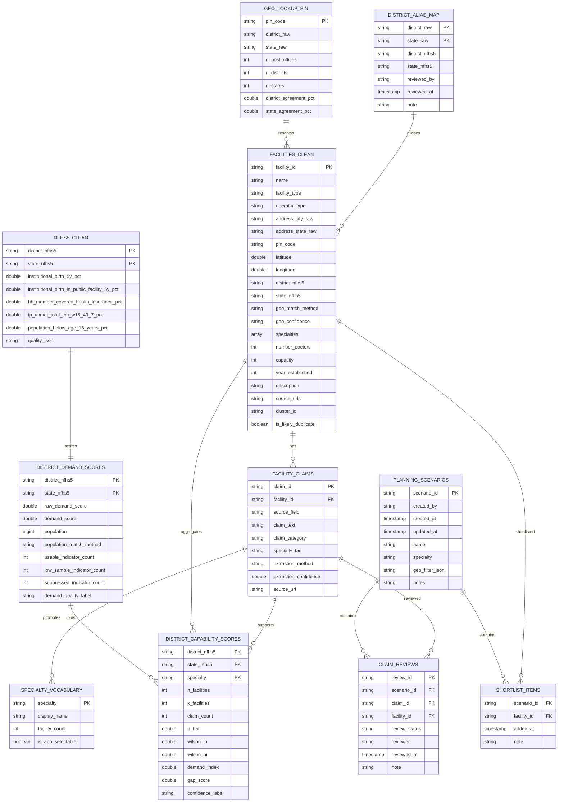

# Data Schema Design - Medical Desert Planner

Implemented for the current data-layer checkpoint.

Target catalog: `medical_desert_planner`.

## Entity Model



## Table Specifications

### `geo_lookup_pin`

One row per India Post PIN.

| Column | Type | Rule |
|---|---|---|
| `pin_code` | STRING | 6-digit PIN from `pincode` |
| `district_raw` | STRING | modal normalized district for the PIN |
| `state_raw` | STRING | modal normalized state for the PIN |
| `n_post_offices` | INT | source rows for the PIN |
| `n_districts` | INT | distinct source districts for the PIN |
| `n_states` | INT | distinct source states for the PIN |
| `district_agreement_pct` | DOUBLE | modal district rows / total rows |
| `state_agreement_pct` | DOUBLE | modal state rows / total rows |

### `district_alias_map`

Hand-reviewed alias table. Required because exact facility-to-NFHS resolution is 61.4%
before aliases.

| Column | Type | Rule |
|---|---|---|
| `district_raw` | STRING | from `geo_lookup_pin` |
| `state_raw` | STRING | from `geo_lookup_pin` |
| `district_nfhs5` | STRING | exact NFHS-5 district spelling |
| `state_nfhs5` | STRING | exact NFHS-5 state spelling |
| `reviewed_by` | STRING | user/email |
| `reviewed_at` | TIMESTAMP | review time |
| `note` | STRING | reason/source for alias |

### `facilities_clean`

One row per valid facility.

| Column | Type | Rule |
|---|---|---|
| `facility_id` | STRING | `unique_id`, valid UUID rows only |
| `name` | STRING | source `name` |
| `facility_type` | STRING | normalize `farmacy` -> `pharmacy`; blank/`"null"` -> NULL |
| `operator_type` | STRING | normalize `government` -> `public`; blank/`"null"` -> NULL |
| `pin_code` | STRING | valid 6-digit `address_zipOrPostcode`, else NULL |
| `latitude`, `longitude` | DOUBLE | keep only India bbox, else NULL |
| `district_nfhs5`, `state_nfhs5` | STRING | exact or aliased match; else `Unresolved` |
| `geo_match_method` | STRING | `pincode_exact`, `pincode_alias`, `coordinate_fallback`, `unresolved` |
| `geo_confidence` | STRING | `high`, `medium`, `low` |
| `specialties` | ARRAY<STRING> | `array_distinct(from_json(specialties))` |
| `number_doctors`, `capacity`, `year_established` | INT | literal `"null"` -> NULL, then cast |
| `source_urls` | STRING | preserve raw JSON-like string for display/linking |
| `is_likely_duplicate` | BOOLEAN | true when `cluster_id` appears more than once |

### `facility_claims`

Every important claim shown in the UI comes from this table.

| Column | Type | Rule |
|---|---|---|
| `claim_id` | STRING | deterministic hash of facility, field, text |
| `facility_id` | STRING | FK to `facilities_clean` |
| `source_field` | STRING | `specialties`, `capability`, `procedure`, `equipment`, `description` |
| `claim_text` | STRING | verbatim source text; never paraphrased |
| `claim_category` | STRING | structured specialty, clinical capability, procedure, equipment, staffing, accreditation, volunteer signal, noise |
| `specialty_tag` | STRING | nullable; maps claim to app capability vocabulary |
| `extraction_method` | STRING | `structured`, `rule`, `llm`, `manual_review` |
| `extraction_confidence` | DOUBLE | nullable |
| `source_url` | STRING | best available URL when source can be tied back |

### `nfhs5_clean`

Parse selected NFHS-5 demand columns into numeric values and quality flags. Keep the raw
columns available in an audit view or JSON quality field.

### `specialty_vocabulary`

App-facing capability vocabulary derived from structured specialty claims. Current build
has 2,106 raw vocabulary rows and 48 `is_app_selectable=true` specialties with at least
500 supporting facilities.

### `district_demand_scores`

One row per NFHS-5 district key. Demand score is only computed when enough selected
indicators are usable.

### `district_capability_scores`

One row per `(state, district, specialty)`.

Wilson interval formula uses `z = 1.96`:

```text
center = (p_hat + z^2/(2n)) / (1 + z^2/n)
half_width = z * sqrt((p_hat*(1-p_hat)/n) + z^2/(4n^2)) / (1 + z^2/n)
wilson_lo = center - half_width
wilson_hi = center + half_width
```

Suggested labels:

| Condition | Label |
|---|---|
| High demand, low `p_hat`, adequate `n`, narrow interval | `likely_real_gap` |
| High demand, low/unknown `p_hat`, small `n` or wide interval | `data_poor_high_need` |
| Conflicting demand/supply or medium interval | `mixed_evidence` |
| Low demand or adequate documented supply | `lower_priority` |

### Persistence Tables

`planning_scenarios`, `shortlist_items`, and `claim_reviews` satisfy the persistence
rubric. They are app-owned and should include created/updated timestamps and user identity
where the app runtime exposes it.
