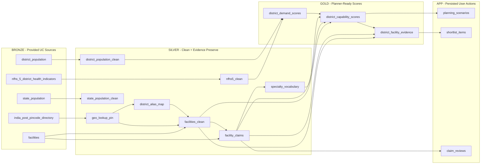

# Medallion Architecture ERD

This is the proposed Bronze/Silver/Gold data model for the Medical Desert Planner. No
tables have been created yet.

## Layered Flow

## Full ERD With Columns

```mermaid
erDiagram
    BRONZE_FACILITIES {
        string unique_id PK
        string name
        string organization_type
        string facilityTypeId
        string operatorTypeId
        string address_line1
        string address_line2
        string address_city
        string address_stateOrRegion
        string address_zipOrPostcode
        double latitude
        double longitude
        string coordinates
        string specialties
        string capability
        string procedure
        string equipment
        string description
        string numberDoctors
        string capacity
        string yearEstablished
        string acceptsVolunteers
        string source_urls
        string cluster_id
    }

    BRONZE_PIN_DIRECTORY {
        bigint pincode
        string officename
        string officetype
        string delivery
        string district
        string statename
        string circlename
        string regionname
        string divisionname
        string latitude
        string longitude
    }

    BRONZE_NFHS5 {
        string district_name
        string state_ut
        double households_surveyed
        double women_15_49_interviewed
        double men_15_54_interviewed
        double institutional_birth_5y_pct
        double institutional_birth_in_public_facility_5y_pct
        double hh_member_covered_health_insurance_pct
        double population_below_age_15_years_pct
        double fp_unmet_total_cm_w15_49_7_pct
        double hh_electricity_pct
        double hh_improved_water_pct
        double hh_use_improved_sanitation_pct
        double households_using_clean_fuel_for_cooking_pct
        double all_w15_49_who_are_anaemic_pct
        string child_12_23m_fully_vaccinated_based_on_information_from_eit_pct
        string children_born_at_home_who_were_taken_to_a_health_facility_f_pct
    }

    BRONZE_DISTRICT_POPULATION {
        bigint Ranking
        string District
        string State
        string Population
        string Growth
        bigint Sex_Ratio
        double Literacy
    }

    BRONZE_STATE_POPULATION {
        string state_ut_name
        string type
        double population_millions
    }

    GEO_LOOKUP_PIN {
        string pin_code PK
        string district_raw
        string state_raw
        int n_post_offices
        int n_districts
        int n_states
        double district_agreement_pct
        double state_agreement_pct
        double centroid_latitude
        double centroid_longitude
        timestamp created_at
    }

    DISTRICT_ALIAS_MAP {
        string district_raw PK
        string state_raw PK
        string district_nfhs5
        string state_nfhs5
        string match_status
        string reviewed_by
        timestamp reviewed_at
        string note
    }

    FACILITIES_CLEAN {
        string facility_id PK
        string name
        string organization_type
        string facility_type
        string operator_type
        string address_line1
        string address_line2
        string address_city_raw
        string address_state_raw
        string pin_code
        double latitude
        double longitude
        string district_raw
        string state_raw
        string district_nfhs5
        string state_nfhs5
        string geo_match_method
        string geo_confidence
        array specialties
        int number_doctors
        int capacity
        int year_established
        string description
        string source_urls
        string cluster_id
        boolean is_likely_duplicate
        timestamp created_at
    }

    NFHS5_CLEAN {
        string district_nfhs5 PK
        string state_nfhs5 PK
        string indicator_name PK
        string source_column
        double numeric_value
        string raw_value
        boolean is_suppressed
        boolean is_low_sample
        string direction_for_need
        timestamp created_at
    }

    DISTRICT_POPULATION_CLEAN {
        string district_raw PK
        string state_raw PK
        bigint population
        double growth_pct
        int sex_ratio
        double literacy_pct
        timestamp created_at
    }

    STATE_POPULATION_CLEAN {
        string state_nfhs5 PK
        string type
        double population_millions
        timestamp created_at
    }

    FACILITY_CLAIMS {
        string claim_id PK
        string facility_id FK
        string source_field
        string claim_text
        string claim_category
        string specialty_tag
        string extraction_method
        double extraction_confidence
        string source_url
        boolean is_noise
        timestamp created_at
    }

    SPECIALTY_VOCABULARY {
        string specialty PK
        string display_name
        int facility_count
        boolean is_app_selectable
        timestamp created_at
    }

    DISTRICT_DEMAND_SCORES {
        string district_nfhs5 PK
        string state_nfhs5 PK
        double raw_demand_score
        double demand_score
        bigint population
        string population_match_method
        int usable_indicator_count
        int low_sample_indicator_count
        int suppressed_indicator_count
        string demand_quality_label
        string demand_explanation
        timestamp created_at
    }

    DISTRICT_CAPABILITY_SCORES {
        string district_nfhs5 PK
        string state_nfhs5 PK
        string specialty PK
        int n_facilities
        int k_facilities
        int claim_count
        double documented_supply_rate
        double wilson_lo
        double wilson_hi
        double demand_score
        double gap_score
        string confidence_label
        string verdict_label
        timestamp created_at
    }

    DISTRICT_FACILITY_EVIDENCE {
        string evidence_id PK
        string district_nfhs5
        string state_nfhs5
        string specialty
        string facility_id FK
        string claim_id FK
        string claim_text
        string source_field
        string source_url
    }

    PLANNING_SCENARIOS {
        string scenario_id PK
        string name
        string created_by
        timestamp created_at
        timestamp updated_at
        string specialty
        string geo_filter_json
        string notes
    }

    SHORTLIST_ITEMS {
        string scenario_id FK
        string facility_id FK
        timestamp added_at
        string note
    }

    CLAIM_REVIEWS {
        string review_id PK
        string scenario_id FK
        string claim_id FK
        string facility_id FK
        string review_status
        string reviewer
        timestamp reviewed_at
        string note
    }

    BRONZE_PIN_DIRECTORY ||--o{ GEO_LOOKUP_PIN : aggregates_to
    GEO_LOOKUP_PIN ||--o{ FACILITIES_CLEAN : resolves_pin
    DISTRICT_ALIAS_MAP ||--o{ FACILITIES_CLEAN : aliases_geography
    BRONZE_FACILITIES ||--o{ FACILITIES_CLEAN : cleans_to
    BRONZE_FACILITIES ||--o{ FACILITY_CLAIMS : source_text_to_claims
    FACILITIES_CLEAN ||--o{ FACILITY_CLAIMS : has_claims
    FACILITY_CLAIMS ||--o{ SPECIALTY_VOCABULARY : promotes_selectable_terms
    BRONZE_NFHS5 ||--o{ NFHS5_CLEAN : parses_indicators
    BRONZE_DISTRICT_POPULATION ||--o{ DISTRICT_POPULATION_CLEAN : cleans
    BRONZE_STATE_POPULATION ||--o{ STATE_POPULATION_CLEAN : cleans
    NFHS5_CLEAN ||--o{ DISTRICT_DEMAND_SCORES : computes
    DISTRICT_POPULATION_CLEAN ||--o{ DISTRICT_DEMAND_SCORES : weights_context
    DISTRICT_DEMAND_SCORES ||--o{ DISTRICT_CAPABILITY_SCORES : joins_need
    FACILITIES_CLEAN ||--o{ DISTRICT_CAPABILITY_SCORES : aggregates_supply
    FACILITY_CLAIMS ||--o{ DISTRICT_CAPABILITY_SCORES : counts_evidence
    SPECIALTY_VOCABULARY ||--o{ DISTRICT_CAPABILITY_SCORES : filters_app_specialties
    FACILITIES_CLEAN ||--o{ DISTRICT_FACILITY_EVIDENCE : explains_facility
    FACILITY_CLAIMS ||--o{ DISTRICT_FACILITY_EVIDENCE : cites_claim
    DISTRICT_CAPABILITY_SCORES ||--o{ DISTRICT_FACILITY_EVIDENCE : supports_score
    PLANNING_SCENARIOS ||--o{ SHORTLIST_ITEMS : contains
    PLANNING_SCENARIOS ||--o{ CLAIM_REVIEWS : contains
    FACILITIES_CLEAN ||--o{ SHORTLIST_ITEMS : shortlisted
    FACILITY_CLAIMS ||--o{ CLAIM_REVIEWS : reviewed
```

## Notes

- `district_demand_scores` is a Delta table, not a vector search index.
- `claim_text` is always verbatim source text and is the citation shown in the app.
- `geo_match_method` and `geo_confidence` are explicit so unresolved or weak geography is
  visible instead of silently hidden.
- `confidence_label` distinguishes `likely_real_gap` from `data_poor_high_need`.
